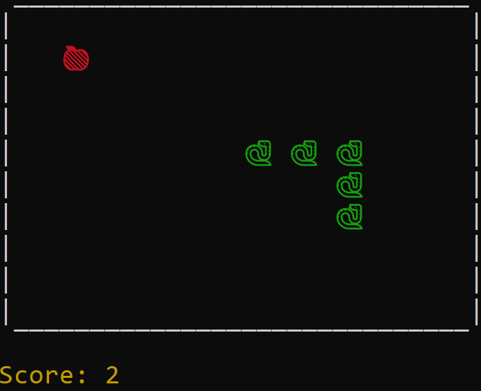

# Snake Game


## Description:
Simple "Snake" game in CLI. The goal was to write it without any source.

Took control of keyboard keys with [keyboard](https://pypi.org/project/keyboard/) library.

### Build with
* [Python 3.11.4](https://www.python.org/downloads/release/python-3114/)

## Game Features
* Snake is able to pass through the border and appear on the opposite side;
* Snake chops itself when the head touches the body;

## Code Features
For styling text color I used [ANSI escape sequences](https://en.wikipedia.org/wiki/ANSI_escape_code). It is a series of control codes used to format and control the output of text in terminal environments.
```
# Colors for terminal
red = "\u001b[31m"
green = "\u001b[32m"
yellow = "\u001b[33m"
reset = "\u001b[0m"
black = "\u001b[30m"
```
Source for research: [Build your own Command Line with ANSI escape codes](https://www.lihaoyi.com/post/BuildyourownCommandLinewithANSIescapecodes.html)
## License

MIT

## Contact
e-mail: yevhenii.memruk@gmail.com
